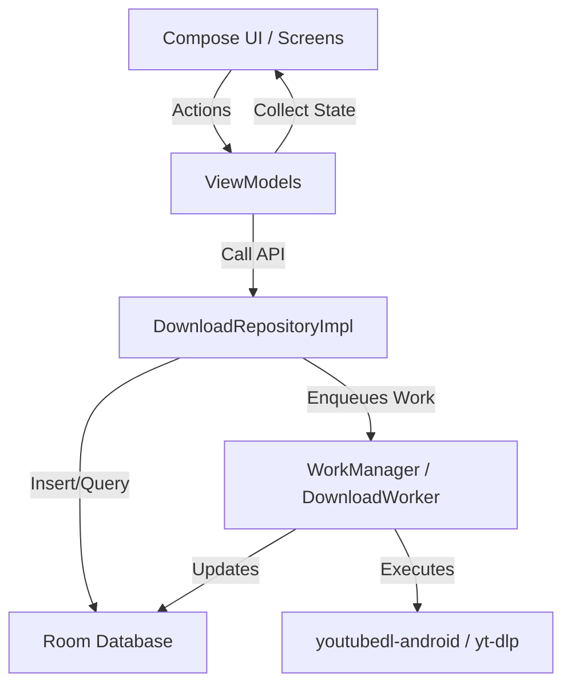

# Codebase Architecture & Context

This document outlines the system architecture, file layouts, database schema, and technical configurations of the Local Video Downloader.

## Technology Stack

1. **Language & Toolchain**: Kotlin (1.9.x+), Gradle Kotlin DSL (`.gradle.kts`).
2. **UI Framework**: Jetpack Compose with Material 3 design elements.
3. **Local Database**: Room DB (SQLite) for tracking tasks, configurations, and vault mappings.
4. **Dependency Injection**: Hilt (dagger-hilt) for scoped injection.
5. **Background Workers**: Android WorkManager (`DownloadWorker`) to handle long-running, process-safe downloads, conversions, and asset extractions.
6. **Download Pipeline**: Official `youtubedl-android` library wrapping precompiled binary dependencies (`yt-dlp` and `FFmpeg` packages).

---

## Directory Map

- **`app/src/main/`**
  - **`java/com/localdownloader/`**
    - **`data/`** - Data access layer, database models, repositories, and preferences.
      - `DownloadRepositoryImpl.kt` - Central manager coordinate downloads, settings, and vault moves.
      - **`persistence/`** - Room database context (`AppDatabase.kt`, `DownloadTaskEntity.kt`, `DownloadTaskDao.kt`).
    - **`media/`** - Media parsing utilities, file type detection, and format decoders.
    - **`ui/`** - Compose components, screens, and styling files.
      - `DownloaderApp.kt` - Main navigation entry, route maps, and global state hosts.
      - **`screens/`** - Modular screen composables (`BrowserScreen`, `DownloadsScreen`, `PlayerScreen`, `MusicPlayerScreen`, `ProgressScreen`, `VaultScreen`).
    - **`utils/`** - Helper utility classes.
      - `FileUtils.kt` - Handles complex file queries, directory layouts, and secure vault transfers.
    - **`viewmodel/`** - State machines and business flows (`FormatViewModel`, `PlayerViewModel`, `VaultViewModel`).
    - **`worker/`** - Async processing pipelines (`DownloadWorker.kt`).
  - **`res/`** - Assets, localized translations (`values/strings.xml`), configuration XML files.
- **`fastlane/`** - Deployment and publishing scripts.
- **`gradle/`** - Gradle wrapper files and dependency verification hashes.

---

## Core Flow Architecture

### 1. Download Scheduling Flow
- A download request starts in `FormatViewModel` after parsing a URL.
- The repository saves a pending `DownloadTaskEntity` in the database.
- A WorkManager job is enqueued. The worker (`DownloadWorker`) executes `yt-dlp` via terminal wrapper configurations, emitting throttled progress updates to the database.
- Compose screens collect the database StateFlow in real-time, displaying immediate progress bars.

### 2. Vault Move Operations
- Secure files reside in an app-private storage folder (`noBackupFilesDir/vault`).
- Moves are processed through [FileUtils.kt](file:///home/error/prj/video-downloader/app/src/main/java/com/localdownloader/utils/FileUtils.kt) using transaction-safe workflows that map primary files alongside their subtitle, image, and JSON metadata sidecars.
