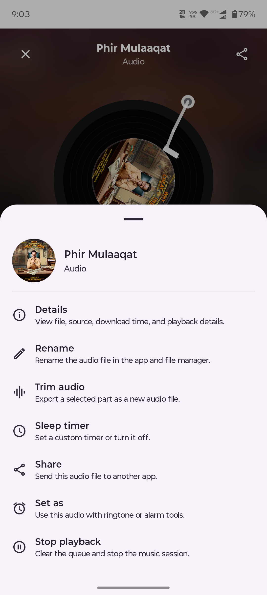
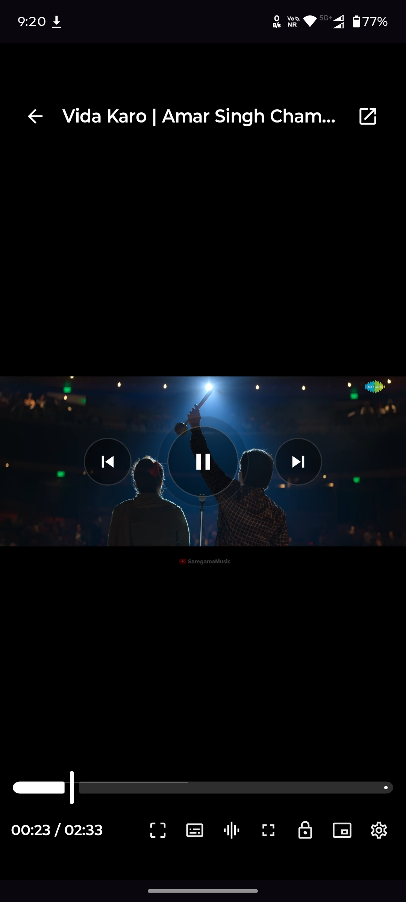
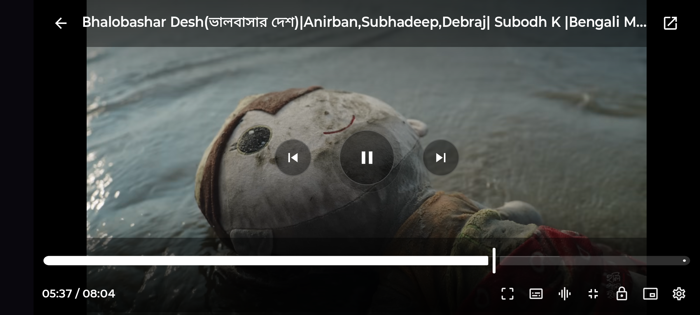

<p align="center">
  
</p>

<h1 align="center">Video Downloader</h1>

<p align="center">
  Local-first Android video downloading powered by <code>yt-dlp</code> and <code>FFmpeg</code>.
</p>

<p align="center">
  Everything runs on-device: no backend, no cloud conversion, no forced account system, and no server-side link handling.
</p>

<p align="center">
  <a href="https://github.com/iam-sandipmaity/video-downloader/actions/workflows/master.yml">
    
  </a>
  <a href="https://github.com/iam-sandipmaity/video-downloader/releases/latest">
    
  </a>
  <a href="https://github.com/iam-sandipmaity/video-downloader/releases/tag/nightly">
    
  </a>
  <a href="CHANGELOG.md">
    
  </a>
  <a href="https://github.com/iam-sandipmaity/video-downloader/releases">
    
  </a>
  <a href="https://github.com/iam-sandipmaity/video-downloader/stargazers">
    
  </a>
  <a href="https://hosted.weblate.org/engage/local-video-downloader/">
    
  </a>
  <a href="https://hosted.weblate.org/engage/local-video-downloader/">
    
  </a>
  <a href="https://video.sandipmaity.me">
    
  </a>
  <a href="COMPATIBILITY.md">
    
  </a>
  <a href="COMPATIBILITY.md">
    
  </a>
  <a href="LICENSE">
    
  </a>
</p>

## 📑 Table of Contents

- [Why This App](#why-this-app)
- [Download](#download)
- [Quick Start](#quick-start)
- [Features](#features)
- [Supported Sources](#supported-sources)
- [App Preview](#app-preview)
- [Supported Languages](#supported-languages)
- [Translation Progress](#translation-progress)
- [Compatibility](#compatibility)
- [Architecture](#architecture)
- [Build From Source](#build-from-source)
- [Repository Docs](#repository-docs)
- [Donate](#donate)
- [License](#license)
- [Credits](#credits)
- [Star History](#star-history)
- [Contributors](#contributors)

## Why This App

| | What it means |
| --- | --- |
| **Local-first** | Analyze links, download media, merge streams, and convert files directly on the device. |
| **Real downloader stack** | Embedded `yt-dlp` plus managed `FFmpeg` paths — no remote relay service. |
| **Built for recovery** | Queueing, retries, diagnostics, cookies, and YouTube access help are part of the product flow. |
| **Useful beyond downloads** | Saved-library browsing, audio/video playback, compression, conversion, and history tools. |

Everything runs on-device: no backend, no cloud conversion, no forced account system, and no server-side link handling.

## Download

### Stable Release

| Obtainium | GitHub |
| --- | --- |
| <a href="https://apps.obtainium.imranr.dev/redirect.html?r=obtainium://add/https://github.com/iam-sandipmaity/video-downloader/releases/latest"></a> | <a href="https://github.com/iam-sandipmaity/video-downloader/releases/latest"></a> |

Stable downloads use GitHub's latest release endpoint, which tracks the newest non-prerelease release and ignores the rolling `nightly` prerelease tag. In Obtainium, keep prereleases disabled for the stable app.

### Nightly / Debug Build

> [!WARNING]
> Nightly builds are unstable and may contain bugs. Use at your own risk.

<p align="center">
  <a href="https://github.com/iam-sandipmaity/video-downloader/releases/tag/nightly">
    
  </a>
</p>

<p align="center">
  <strong>Rolling nightly release tag</strong> — always points to the newest successful <code>main</code> debug build
</p>

Nightly downloads use the rolling `nightly` release tag, which is separate from stable releases. Nightly-only changes are tracked in [CHANGELOG-NIGHTLY.md](CHANGELOG-NIGHTLY.md).

### Requirements

- **Minimum:** Android 8.0+
- **Primary shipped ABI:** `arm64-v8a`
- **Public downloads root:** `Download/LocalDownloader/`

## Quick Start

1. **Install** — grab the latest stable build from [Releases](https://github.com/iam-sandipmaity/video-downloader/releases/latest) or via [Obtainium](https://apps.obtainium.imranr.dev/redirect.html?r=obtainium://add/https://github.com/iam-sandipmaity/video-downloader/releases/latest).
2. **Paste a link** — any supported URL goes in the home screen input. The app analyzes it locally and shows available formats.
3. **Pick and download** — choose format/quality, optionally rename, and hit download. Pause, resume, or retry anytime from the queue.

## Features

**Downloads**

- Video downloads with format, quality, and container selection
- Audio-only downloads with music-friendly outputs
- Playlist downloads with global defaults and per-item overrides
- Download queue with pause, resume, retry, and diagnostics
- Download history with per-task logs and traces
- Cookies and YouTube access recovery tools for harder sites
- Rename outputs before download, keep source thumbnails
- Auto post-processing when audio/video streams need merging

**Built-in tools**

- Saved downloads library with share, delete, and batch actions
- In-app audio player (vinyl-style artwork, queue controls, trim, sleep timer)
- In-app video player (portrait and landscape, full-screen flow)
- Built-in converter and compressor flows

**Updates & localization**

- Updates center for the app, `yt-dlp`, and `FFmpeg`
- Multi-language UI with expanding coverage

## Supported Sources

Powered by `yt-dlp`, the app supports **1,000+ sites** out of the box, including:

| | | |
| --- | --- | --- |
| YouTube | Instagram | Twitter / X |
| Facebook | TikTok | Twitch |
| Vimeo | SoundCloud | Reddit |
| Bandcamp | Dailymotion | …and many more |

For the full list, see the [yt-dlp support database](https://github.com/yt-dlp/yt-dlp/blob/master/supportedsites.md).

## App Preview

<details>
<summary><b>Home & Link Analysis</b></summary>

| Home | Link Analyzing | Single Download Sheet |
| --- | --- | --- |
|  |  |  |
| URL entry, ready-history cards, and the main download starting point. | Active metadata extraction before formats are shown. | Format, naming, and final output controls for a single media item. |

</details>

<details>
<summary><b>Playlist & Queue</b></summary>

| Playlist Picker | Per-File Playlist Controls |
| --- | --- |
|  |  |
| Global playlist selection before queuing. | Item-level overrides for format and file naming. |

| Active Queue Screen | Queue Tab |
| --- | --- |
|  |  |
| Live task progress with worker-driven updates. | Broader queue view for running, queued, and failed items. |

</details>

<details>
<summary><b>Library & Playback</b></summary>

| Downloads Library | Saved File Viewer |
| --- | --- |
|  |  |
| Local media library with file actions and browsing. | File-centric view of saved downloads. |

| In-App Audio Player | Audio Player Options | In-App Video Player |
| --- | --- | --- |
|  |  |  |
| Music-style playback with artwork, queue controls, and audio-source switching. | Details, trim, sleep timer, share, and set-as actions for local tracks. | Full-screen player flow for downloaded video. |

| Video Player — Portrait | Video Player — Landscape |
| --- | --- |
|  |  |
| Touch-first portrait playback controls. | Wide playback layout for landscape viewing. |

</details>

<details>
<summary><b>Settings & Support Surfaces</b></summary>

| More Page | Settings Hub |
| --- | --- |
|  |  |
| Utility shortcuts, tools, updates, and help entry points. | Main settings navigation with grouped categories. |

| Appearance Page | About & Credits |
| --- | --- |
|  |  |
| Theme, accent, contrast, and language-adjacent presentation controls. | Credits and upstream acknowledgements inside the app. |

</details>

<details>
<summary><b>Access & Media Tools</b></summary>

| Cookies Page | YouTube Access |
| --- | --- |
|  |  |
| Saved cookie/session management for harder sites. | Dedicated YouTube session and access recovery flow. |

| Converter | Compressor |
| --- | --- |
|  |  |
| Format conversion utility built into the app. | Compression workflow for media size reduction. |

</details>

<details>
<summary><b>Localization Examples</b></summary>

| Appearance In Bengali | Notification Settings In Bengali |
| --- | --- |
|  |  |
| One of the localized settings surfaces. | Another example of translated in-app settings UI. |

</details>

## Supported Languages

Current in-app language support includes:

- English
- Hindi
- Bengali
- Dutch
- French
- German
- Spanish
- Tamil
- Telugu
- Kannada
- Malayalam
- Korean
- Japanese
- Simplified Chinese

## Translation Progress

<p align="center">
  <a href="https://hosted.weblate.org/engage/local-video-downloader/">
    
  </a>
</p>

<p align="center">
  <a href="https://hosted.weblate.org/engage/local-video-downloader/">
    
  </a>
</p>

<p align="center">
  <a href="https://hosted.weblate.org/engage/local-video-downloader/">
    
  </a>
</p>

Want to improve a translation? Use
[Hosted Weblate](https://hosted.weblate.org/projects/local-video-downloader/android-app-strings/)
or send a direct pull request against the Android resource files.

## Compatibility

- Android 8.0 and above
- Primary shipped ABI: `arm64-v8a`
- Public downloads root: `Download/LocalDownloader/`

> [!NOTE]
> If you experience runtime crashes, extractor tracebacks, or execution failures on a specific Android version or CPU architecture, it is likely due to binary compatibility limits. Please refer to the [Compatibility Guide](COMPATIBILITY.md) for detailed troubleshooting steps, architecture details, and fallback builds.

## Architecture

The app is built around:

- Kotlin
- Jetpack Compose
- MVVM-style state handling
- Hilt dependency injection
- WorkManager background execution
- Room and DataStore persistence
- embedded `youtubedl-android` runtime
- packaged and managed `FFmpeg` runtime paths

High-level flow:

1. Paste a link and analyze it.
2. Select format, naming, and optional extras.
3. Queue the task through WorkManager.
4. Execute `yt-dlp` locally.
5. Apply `FFmpeg` post-processing when needed.
6. Save outputs into the public download folders and app library.

For deeper implementation notes, see:

- [docs/architecture.md](docs/architecture.md)
- [docs/development.md](docs/development.md)
- [IMPLEMENTATION.md](IMPLEMENTATION.md)

## Build From Source

Requirements:

- JDK 17
- Android SDK
- use the bundled Gradle wrapper from the repository root

```bash
git clone https://github.com/iam-sandipmaity/video-downloader
cd video-downloader
./gradlew :app:assembleStandardDebug
```

Use `gradlew.bat` instead of `./gradlew` when running from PowerShell or Command Prompt on Windows.

Debug APK output:

```text
app/build/outputs/apk/standard/debug/app-standard-debug.apk
```

Repo-safe build for IzzyOnDroid or F-Droid style distribution:

```bash
./gradlew :app:assembleRepoSafeDebug
```

Repo-safe APK output:

```text
app/build/outputs/apk/repoSafe/debug/app-repoSafe-debug.apk
```

## Repository Docs

- [CHANGELOG.md](CHANGELOG.md)
- [COMPATIBILITY.md](COMPATIBILITY.md)
- [PRIVACY.md](PRIVACY.md)
- [KEYSTORE_SETUP.md](KEYSTORE_SETUP.md)
- [RELEASE_CHECKLIST.md](RELEASE_CHECKLIST.md)
- [SECURITY.md](SECURITY.md)
- [CONTRIBUTING.md](CONTRIBUTING.md)
- [CODE_OF_CONDUCT.md](CODE_OF_CONDUCT.md)
- [PROJECT_AUDIT.md](PROJECT_AUDIT.md)
- [future-plan.md](future-plan.md)

## Donate

If this project helps you, you can support ongoing development on [Razorpay](https://razorpay.me/@maitysandip).

## License

This project is licensed under the [MIT License](LICENSE).

## Credits

This app builds on top of multiple open-source tools and libraries, including:

- `yt-dlp`
- `FFmpeg`
- Android Jetpack
- Kotlin
- Material 3

The in-app About section also lists upstream credits and linked sources.

## Star History

<a href="https://www.star-history.com/#iam-sandipmaity/video-downloader&Timeline">
 
</a>

## Contributors

<p align="center">
  <a href="https://github.com/iam-sandipmaity/video-downloader/graphs/contributors">
    
  </a>
</p>
