<p align="center">
  
</p>

<h1 align="center">Video Downloader</h1>

<p align="center">
  Local-first Android video downloading powered by <code>yt-dlp</code> and <code>FFmpeg</code>.
</p>

<p align="center">
  Everything runs on-device: no backend, no cloud conversion, no forced account system, and no server-side link handling.
</p>

<p align="center">
  <a href="https://github.com/iam-sandipmaity/video-downloader/actions/workflows/master.yml">
    
  </a>
  <a href="https://github.com/iam-sandipmaity/video-downloader/releases">
    
  </a>
  <a href="https://github.com/iam-sandipmaity/video-downloader/releases">
    
  </a>
  <a href="https://hosted.weblate.org/projects/local-video-downloader/android-app-strings/">
    
  </a>
  <a href="https://video.sandipmaity.me">
    
  </a>
  <a href="COMPATIBILITY.md">
    
  </a>
  <a href="COMPATIBILITY.md">
    
  </a>
  <a href="LICENSE">
    
  </a>
</p>

## Why This App

| Local-first | Real downloader stack | Built for recovery | Useful beyond downloads |
| --- | --- | --- | --- |
| Analyze links, download media, merge streams, and convert files directly on the device. | Uses embedded `yt-dlp` plus managed `FFmpeg` paths instead of a remote relay service. | Queueing, retries, diagnostics, cookies, YouTube access help, and runtime updates are part of the product flow. | Includes saved-library browsing, audio/video playback, compression, conversion, and history tools. |

## Download

### Stable Release

| Obtainium | GitHub |
| --- | --- |
| <a href="https://apps.obtainium.imranr.dev/redirect.html?r=obtainium://add/https://github.com/iam-sandipmaity/video-downloader"></a> | <a href="https://github.com/iam-sandipmaity/video-downloader/releases"></a> |

### Nightly / Debug Build

> Nightly builds are unstable and may contain bugs. Use at your own risk.

<p align="center">
  <a href="https://nightly.link/iam-sandipmaity/video-downloader/workflows/master.yml/main/nightly-debug-apk">
    
  </a>
</p>

<p align="center">
  <strong>Latest nightly debug build artifact</strong> - always points to the newest successful <code>main</code> build
</p>

### Requirements

- Minimum requirement: Android 8.0+

## What You Can Do

- Paste a supported link, analyze it locally, and choose from the formats `yt-dlp` exposes for that source.
- Download single videos, audio-only files, or playlists with global defaults plus per-item overrides.
- Rename outputs before download, keep source thumbnails, and let the app handle post-processing when audio/video streams need merging.
- Pause, resume, retry, inspect, and recover queue items without needing a desktop companion app.
- Open completed downloads in the built-in audio or video players, or manage them from the local library with share and delete actions.
- Use cookies and YouTube access helpers when a site needs session data for better compatibility.
- Run conversion and compression workflows directly on the device after a download finishes.

## How The App Feels In Practice

| Before download | While downloading | After download |
| --- | --- | --- |
| Link analysis, format selection, naming control, cookies, and access recovery are built into the main flow. | Queue diagnostics, pause/resume behavior, and worker-backed retries help tougher downloads stay manageable. | Saved media stays available in the local library with playback, sharing, cleanup, and follow-up media tools. |

## Practical Focus

- Stability-first download behavior instead of backend-heavy automation.
- Local processing with minimal trust in external services.
- Recovery paths for difficult sites, network hiccups, and post-processing failures.
- UI surfaces that stay useful for regular downloading instead of exposing raw runtime complexity everywhere.

For release-specific changes, see [CHANGELOG.md](CHANGELOG.md).

## App Preview

### Home And Link Analysis

| Home | Link Analyzing | Single Download Sheet |
| --- | --- | --- |
| 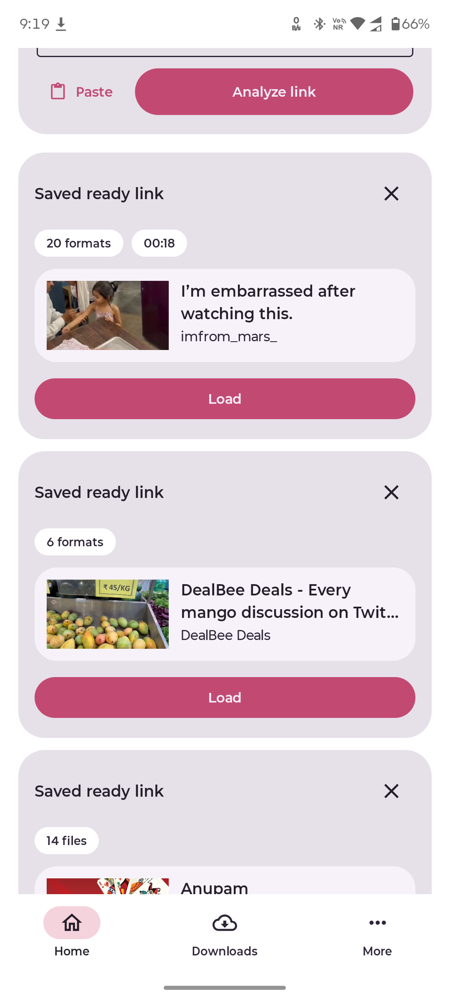 | 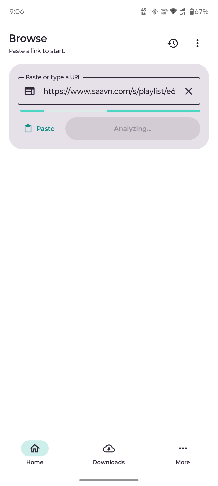 | 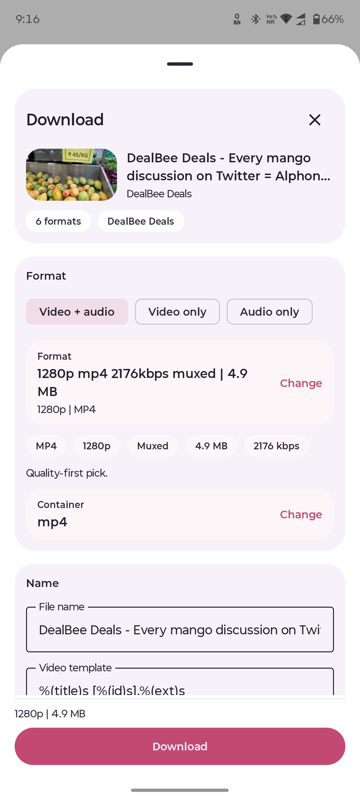 |
| URL entry, ready-history cards, and the main download starting point. | Active metadata extraction before formats are shown. | Format, naming, and final output controls for a single media item. |

### Playlist And Queue

| Playlist Picker | Per-File Playlist Controls |
| --- | --- |
| 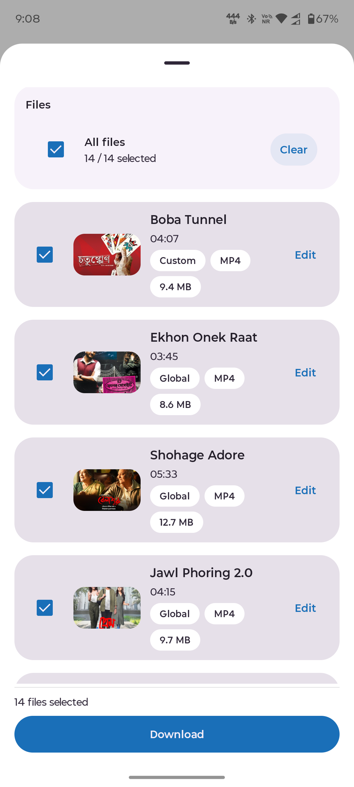 | 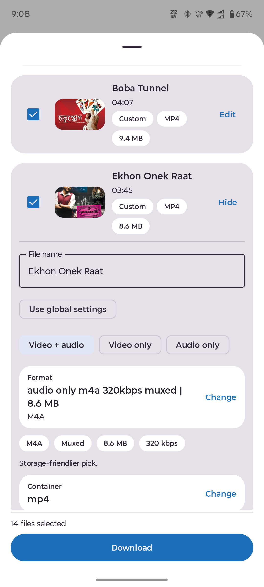 |
| Global playlist selection before queuing. | Item-level overrides for format and file naming. |

| Active Queue Screen | Queue Tab |
| --- | --- |
| 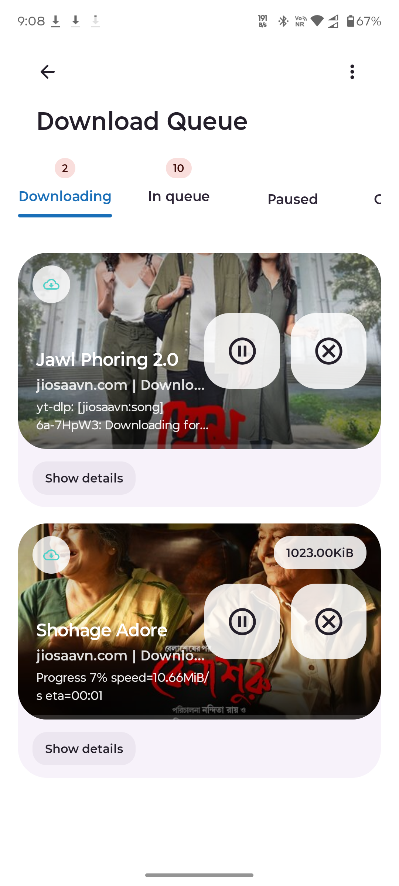 | 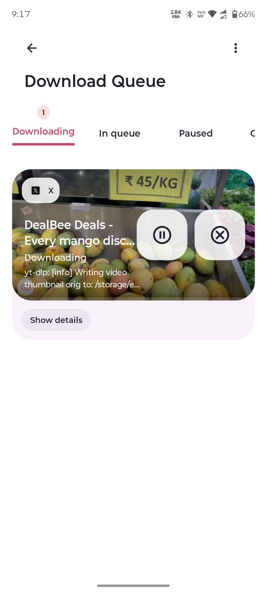 |
| Live task progress with worker-driven updates. | Broader queue view for running, queued, and failed items. |

### Library And Playback

| Downloads Library | Saved File Viewer |
| --- | --- |
| 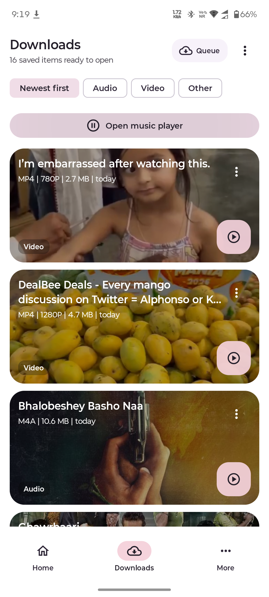 | 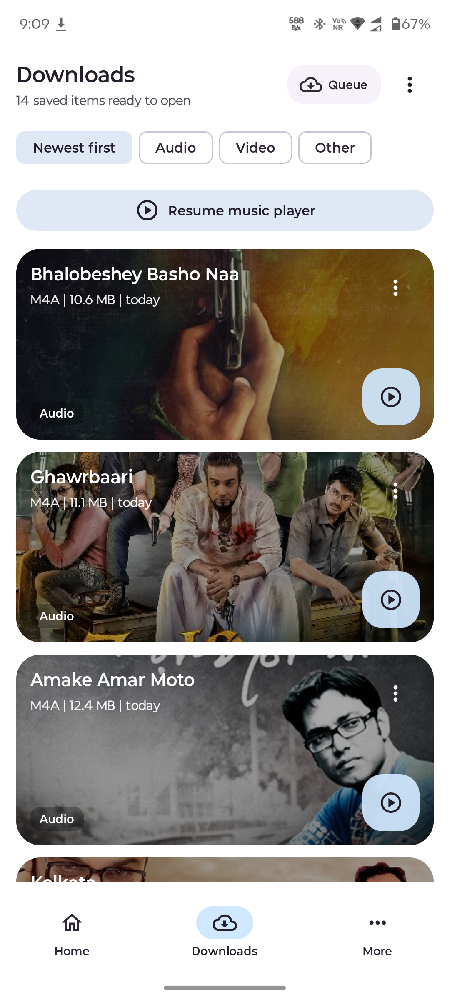 |
| Local media library with file actions and browsing. | File-centric view of saved downloads. |

| In-App Audio Player | In-App Video Player |
| --- | --- |
| 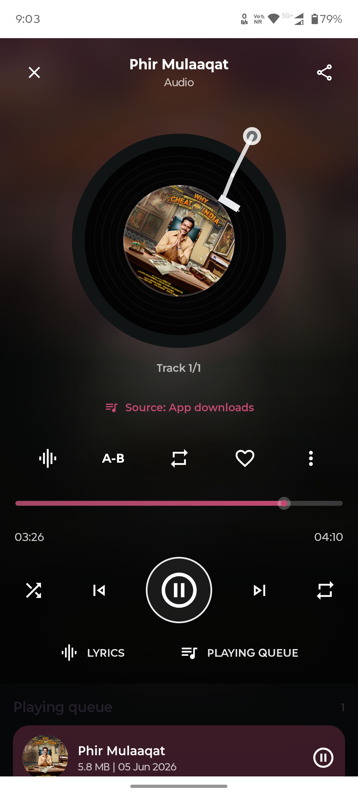 | 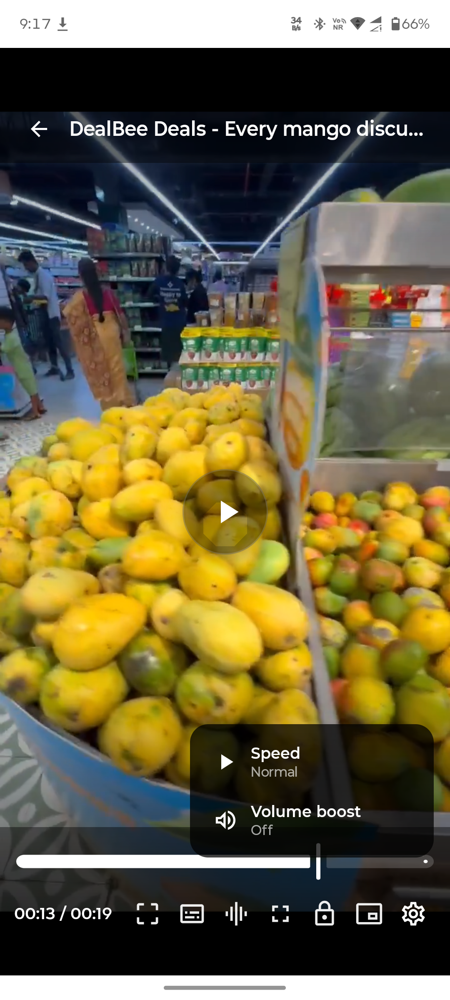 |
| Music-style playback for downloaded audio. | Full-screen player flow for downloaded video. |

### Settings And Support Surfaces

| More Page | Settings Hub |
| --- | --- |
| 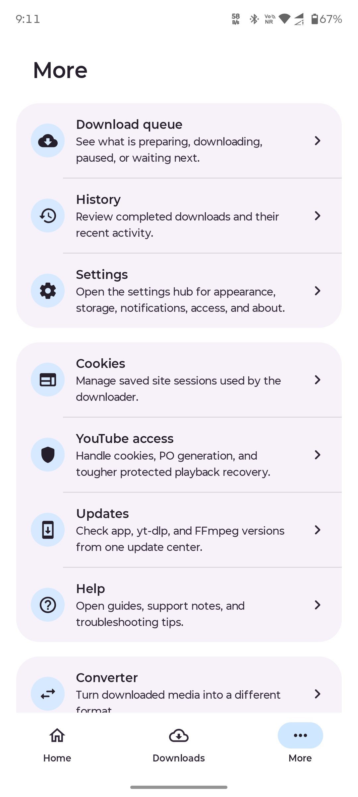 | 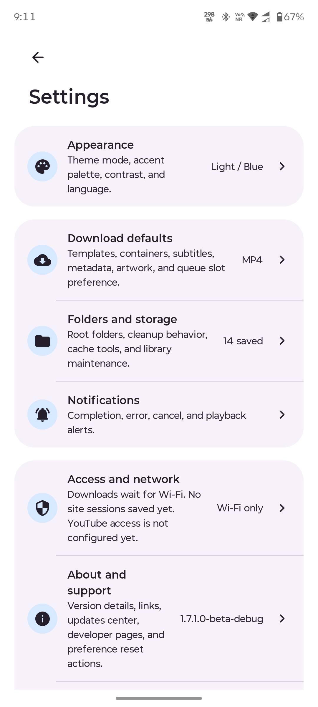 |
| Utility shortcuts, tools, updates, and help entry points. | Main settings navigation with grouped categories. |

| Appearance Page | About And Credits |
| --- | --- |
| 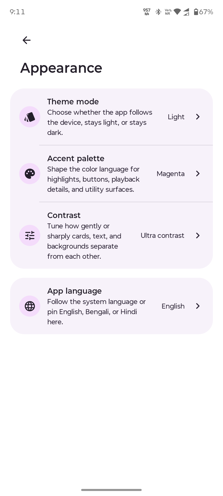 | 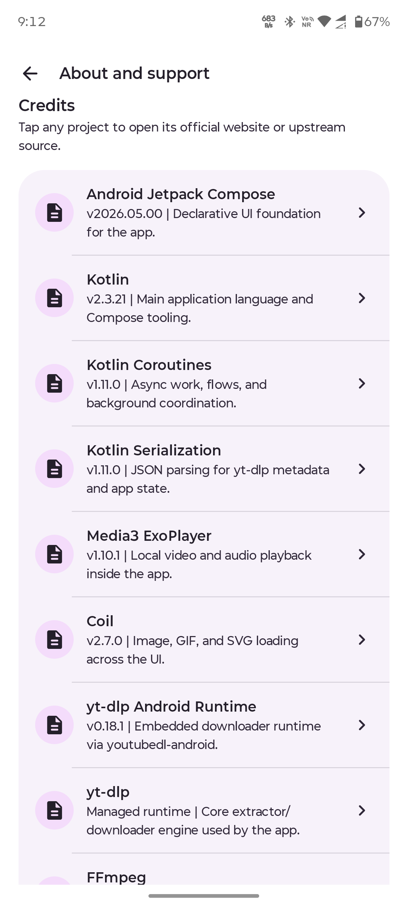 |
| Theme, accent, contrast, and language-adjacent presentation controls. | Credits and upstream acknowledgements inside the app. |

### Access And Media Tools

| Cookies Page | YouTube Access |
| --- | --- |
| 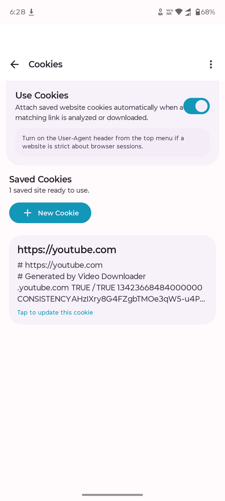 | 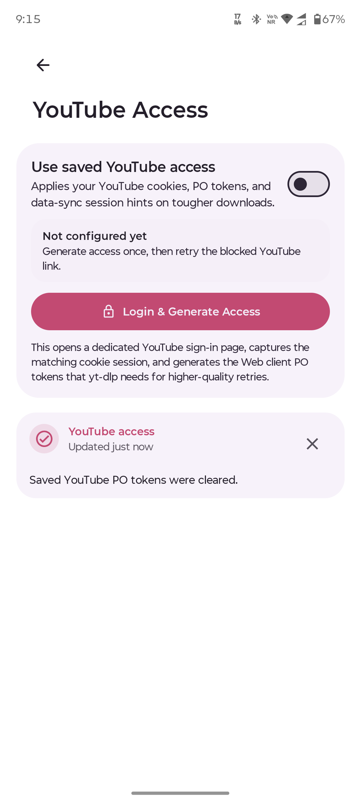 |
| Saved cookie/session management for harder sites. | Dedicated YouTube session and access recovery flow. |

| Converter | Compressor |
| --- | --- |
| 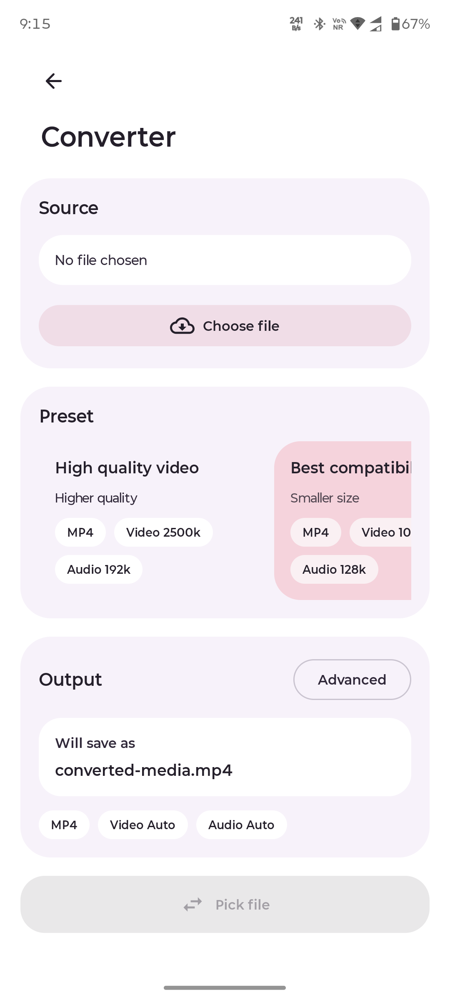 | 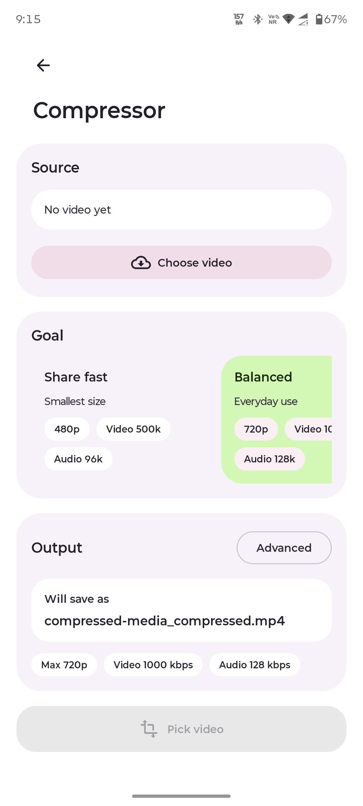 |
| Format conversion utility built into the app. | Compression workflow for media size reduction. |

### Localization Examples

| Appearance In Bengali | Notification Settings In Bengali |
| --- | --- |
| 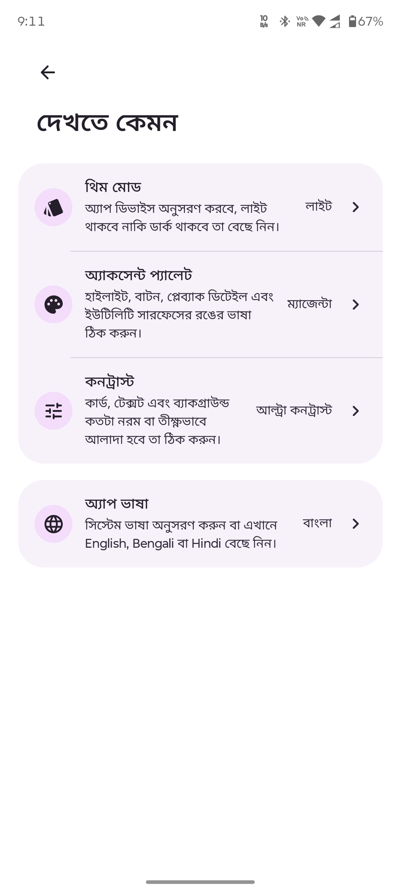 | 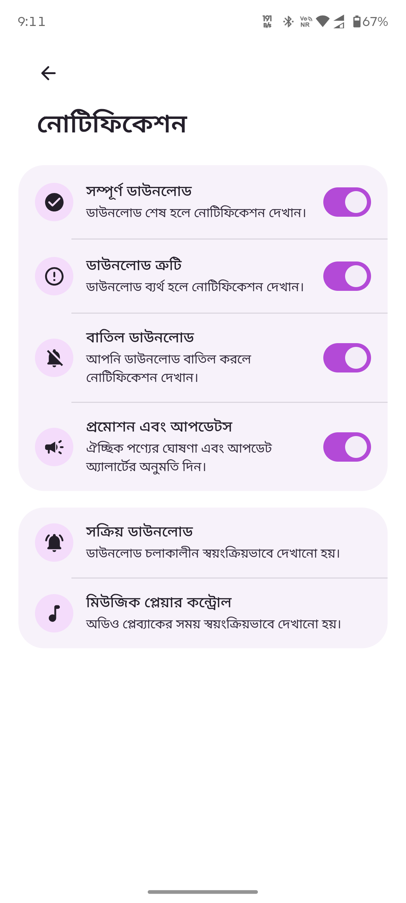 |
| One of the localized settings surfaces. | Another example of translated in-app settings UI. |

## Feature Set

- Video downloads with format, quality, and container selection.
- Audio-only downloads with music-friendly outputs.
- Playlist downloads with global defaults and per-item overrides.
- Download queue with pause, resume, retry, and diagnostics.
- Saved downloads library with share, delete, and batch actions.
- Download history with per-task logs and traces.
- Cookies and YouTube access recovery tools.
- Built-in converter and compressor flows.
- Updates center for the app, `yt-dlp`, and `FFmpeg`.
- Multi-language UI with expanding coverage.

## Supported Languages

Current in-app language support includes:

- English
- Hindi
- Bengali
- Tamil
- Telugu
- Kannada
- Malayalam
- Korean
- Japanese
- Simplified Chinese

## Translation Progress

<p align="center">
  <a href="https://hosted.weblate.org/projects/local-video-downloader/android-app-strings/">
    
  </a>
</p>

Want to improve a translation? Use
[Hosted Weblate](https://hosted.weblate.org/projects/local-video-downloader/android-app-strings/)
or send a direct pull request against the Android resource files. The project is
migrating translation work from Crowdin to Weblate so community translations can
continue on libre hosting.

## Compatibility

- Android 8.0 and above
- Primary shipped ABI: `arm64-v8a`
- Public downloads root: `Download/LocalDownloader/`

For custom ABI builds or deeper runtime details, see [COMPATIBILITY.md](COMPATIBILITY.md).

## Architecture Summary

The app is built around:

- Kotlin
- Jetpack Compose
- MVVM-style state handling
- Hilt dependency injection
- WorkManager background execution
- Room and DataStore persistence
- embedded `youtubedl-android` runtime
- packaged and managed `FFmpeg` runtime paths

High-level flow:

1. Paste a link and analyze it.
2. Select format, naming, and optional extras.
3. Queue the task through WorkManager.
4. Execute `yt-dlp` locally.
5. Apply `FFmpeg` post-processing when needed.
6. Save outputs into the public download folders and app library.

For deeper implementation notes, see:

- [docs/architecture.md](docs/architecture.md)
- [docs/development.md](docs/development.md)
- [IMPLEMENTATION.md](IMPLEMENTATION.md)

## Build From Source

Requirements:

- JDK 17
- Android SDK
- use the bundled Gradle wrapper from the repository root

```bash
git clone https://github.com/iam-sandipmaity/video-downloader
cd video-downloader
./gradlew :app:assembleStandardDebug
```

Use `gradlew.bat` instead of `./gradlew` when running from PowerShell or Command Prompt on Windows.

Debug APK output:

```text
app/build/outputs/apk/standard/debug/app-standard-debug.apk
```

Repo-safe build for IzzyOnDroid or F-Droid style distribution:

```bash
./gradlew :app:assembleRepoSafeDebug
```

Repo-safe APK output:

```text
app/build/outputs/apk/repoSafe/debug/app-repoSafe-debug.apk
```

## Repository Docs

- [CHANGELOG.md](CHANGELOG.md)
- [COMPATIBILITY.md](COMPATIBILITY.md)
- [PRIVACY.md](PRIVACY.md)
- [KEYSTORE_SETUP.md](KEYSTORE_SETUP.md)
- [RELEASE_CHECKLIST.md](RELEASE_CHECKLIST.md)
- [SECURITY.md](SECURITY.md)
- [CONTRIBUTING.md](CONTRIBUTING.md)
- [CODE_OF_CONDUCT.md](CODE_OF_CONDUCT.md)
- [PROJECT_AUDIT.md](PROJECT_AUDIT.md)
- [future-plan.md](future-plan.md)

## Donate

If this project helps you, you can support ongoing development on [Razorpay](https://razorpay.me/@maitysandip).

## License

This project is licensed under the [MIT License](LICENSE).

## Credits

This app builds on top of multiple open-source tools and libraries, including:

- `yt-dlp`
- `FFmpeg`
- Android Jetpack
- Kotlin
- Material 3

The in-app About section also lists upstream credits and linked sources.

## Star History

<a href="https://www.star-history.com/#iam-sandipmaity/video-downloader&Timeline">
 
</a>

## Contributors

<p align="center">
  <a href="https://github.com/iam-sandipmaity/video-downloader/graphs/contributors">
    
  </a>
</p>
