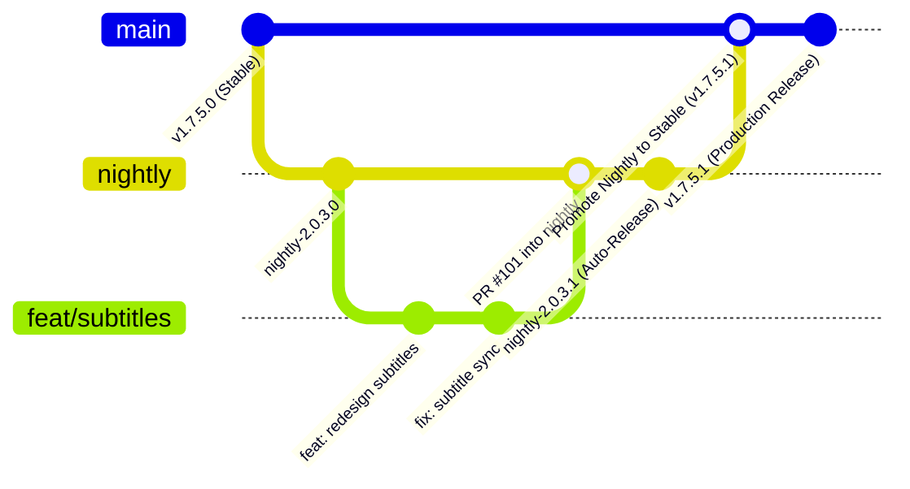

# Branching Strategy & Release Lifecycle

This document outlines the Git branching strategy, contribution lifecycle, and automated release pipeline for **Video Downloader**.

---

## Overview

The repository uses a **3-tier staged release model** to ensure bleeding-edge features can be thoroughly tested in Nightly builds without compromising the stability of production releases.



---

## The Three Branches

### 1. Feature / Fix Branches (`feat/*`, `fix/*`, `chore/*`)
- **Base Branch**: `nightly`
- **Purpose**: All active development, bug fixes, UI improvements, and new features.
- **Workflow**:
  1. Branch off `nightly` (`git checkout -b feat/my-feature nightly`).
  2. Implement changes and write/run unit tests.
  3. Push and open a Pull Request targeting the **`nightly`** branch.
- **CI Behavior**: GitHub Actions validates compilation (`:app:compileStandardDebugKotlin`), runs unit tests, and executes Android lint checks. **No public releases are published** during PR testing.

### 2. `nightly` Branch (Staging / Bleeding Edge)
- **Purpose**: Primary integration branch for active development and early testing.
- **Audience**: Early adopters, testers, and maintainers.
- **App Configuration**:
  - Package Name: `com.localdownloader.nightly` (installs side-by-side with Stable).
  - App Label: `Nightly - <version>` (e.g. `Nightly - 2.0.3.1`).
  - Signing: Internal Debug keystore.
- **Release Automation**:
  - Every merge to `nightly` (or the daily schedule at 03:00 UTC) automatically builds `assembleStandardNightly`, tags `nightly`, and updates the rolling [GitHub Nightly Pre-release](https://github.com/iam-sandipmaity/video-downloader/releases/tag/nightly).
  - Changes are recorded in [`CHANGELOG-NIGHTLY.md`](../CHANGELOG-NIGHTLY.md).

### 3. `main` Branch (Production Stable)
- **Purpose**: Clean, production-ready releases for general users.
- **Audience**: All public users and [Obtainium](https://apps.obtainium.imranr.dev/) track.
- **App Configuration**:
  - Package Name: `com.localdownloader`.
  - App Label: `Video Downloader`.
  - Signing: Production Release keystore.
- **Release Automation**:
  - Merging `nightly` into `main` checks `APP_VERSION_NAME` in `gradle.properties`. If the version tag does not yet exist on GitHub, CI builds `assembleStandardRelease` and publishes a new production GitHub Release (e.g. `v1.7.5.1`).
  - Production changes are recorded in [`CHANGELOG.md`](../CHANGELOG.md).

---

## Step-by-Step Contributor Guide

### 1. Creating a Feature or Fix
```bash
# Ensure local nightly is up to date
git checkout nightly
git pull origin nightly

# Create your topic branch
git checkout -b feat/cool-new-feature
```

### 2. Local Testing
Before opening your PR, test your changes locally:
```bash
# Compile and test
./gradlew :app:compileStandardDebugKotlin
./gradlew :app:testStandardDebugUnitTest

# Assemble debug APK for on-device testing
./gradlew :app:assembleStandardDebug
```

### 3. Submitting a Pull Request
- Target the **`nightly`** branch in your GitHub PR.
- Fill out the PR template describing the changes, testing steps, and screenshots (for UI changes).

---

## Maintainer Guide: Promoting Nightly to Stable

When a batch of nightly features and fixes is thoroughly tested and ready for production:

1. **Create a Promotion Branch from `nightly`**:
   ```bash
   git checkout nightly
   git pull origin nightly
   git checkout -b chore/promote-nightly-to-stable
   ```

2. **Update Metadata in `gradle.properties`**:
   - Increment `APP_VERSION_CODE` (e.g., `34 -> 35`).
   - Bump `APP_VERSION_NAME` (e.g., `1.7.5.1 -> 1.7.6.0`).

3. **Promote Changelog Entries**:
   - Move relevant entries from [`CHANGELOG-NIGHTLY.md`](../CHANGELOG-NIGHTLY.md) into [`CHANGELOG.md`](../CHANGELOG.md) under a new version heading `## [X.Y.Z] - YYYY-MM-DD`.

4. **Open a PR into `main`**:
   - Open a PR from `chore/promote-nightly-to-stable` targeting **`main`**.
   - Review CI check results.

5. **Merge to `main`**:
   - Merge the PR into `main`.
   - GitHub Actions will automatically detect the new version, build the minified release APK, sign it with the release keystore, and create the official GitHub release!

6. **Sync `main` back into `nightly`**:
   ```bash
   git checkout nightly
   git merge main
   git push origin nightly
   ```
